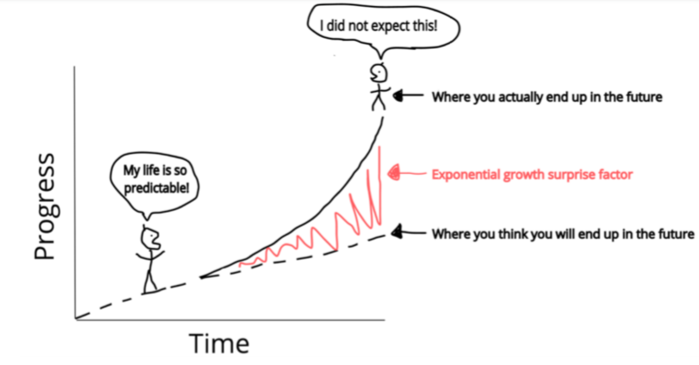
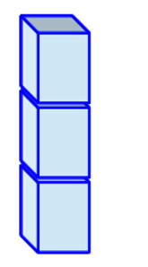
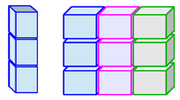
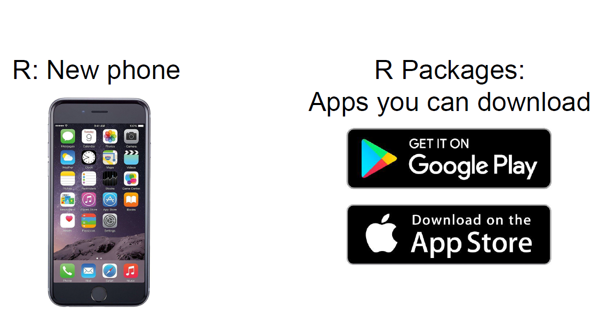

<style>
.reveal h1, .reveal h2, .reveal h3 {
  word-wrap: normal;
  -moz-hyphens: none;
}

/* code */
.small-code pre code {
  font-size: 1.4em;
}
.font50 {
  font-size: 50%;
}
/* footer */
.footer {
    font-size: 0.3em;
    color: black; 
    background: #E8E8E8;
    position: fixed; 
    top: 100%;
    text-align:center; 
    width:100%;
}
.midcenter {
    position: fixed;
    top: 50%;
    left: 50%;
}
/* first slide titles */
.title {
  font-size: 0.3em;
  font-style: italic;
  color: white;
  text-align: center;
}
.section .reveal h1, h2{
    color: black;
    font-weight: bold;
  }

/* first slide titles */
.centeremp {
  font-size: 0.3em;
  font-style: italic;
  color: red;
  text-align: center;
}

/* slide titles */
.reveal h3 { 
  font-size: 160%;
  color: gray;
  top: 150%;
  font-family: 'Montserrat';
  line-height: 105%;
}
/* body text, ordered and unordered list styles */
.reveal ul, 
.reveal ol, 
.reveal p{
    font-size: 120%;
    line-height: 105%;
    list-style-type: disc;
}
/* first slide titles */
.empred {
  -webkit-animation-name: pulse;
  animation-name: pulse;
  font-size: 0.3em;
  font-style: bold;
  color: red;
  text-align: center;
}
</style>

========================================================
author: 
class: title-slide
font-family: 'Helvetica'
css: custom.css
width: 1540
height: 900

<br><br><br><br>
<div class="title" style="font-size: .8em;">A very brief..</div>

<div class="title" style="font-size: 2.5em": ">Intro to R</div>

<br><br><br><br><br>
<hr />
<p style="text-align: center;"><a href="https://github.com/mladencucak/">Mladen Čučak</a></p>
<p style="text-align: center;"><span style="color: #808080;"><em>mladencucak@gmail.com</em></span></p>


Topics
========================================================
- About R/RStudio
- Basics of programming with R
- Data analysis with `tidyverse`
 
<br><br><br><br><br><br><br><br>
These materials are based on the APS's "R for Plant Pathologists" ["R for Plant Pathologists"](https://everhartlab.github.io/APS_IntroR_2020/index.html)    
Some inspiration from [J. Bryan's Stat545](https://stat545.com/) and  [B. Bohemke's Intro to R](https://github.com/uc-r)  
<u>*All highly recommended*</u>


Why R 
========================================================
  <br>
-   **Performance**: stable, light and fast

-   **Support network**: documentation, community, developers

-   **Reproducibility**: anyone anywhere can reproduce results

-   **Versatility**: unified solution to *almost* any numerical problem and 
graphical capabilities

-   **Ethics**: accessible to anyone as it is free and open source


Be strong! 
====================================
  Transition from "point and click" is tough but rewarding

<div align="center">
  
  </div>
  
  Baby steps
====================================
<!-- I am decent programmer now. I know what to type in search box! -->
Help:
* **Google**: just add "with R" at the end of any search
* **Stack Overflow**: programming questions
* **Cross Validated**: scientific questions  

Learning:
  * "R for Data Science" → <https://r4ds.had.co.nz>
  * R4DS Learning Community → <https://rfordatasci.com>
  
  Baby steps
====================================
<!-- I am decent programmer now. I know what to type in search box! -->
Help:
* **Google**: just add "with R" at the end of any search
* **Stack Overflow**: programming questions
* **Cross Validated**: scientific questions  

Learning:
  * "R for Data Science" → <https://r4ds.had.co.nz>
  * R4DS Learning Community → <https://rfordatasci.com>
  <br><br>
  <div class="centeremp" style="font-size: 1.1em;">
  There are (too) many resources! So...
<br><br>Stay focused! <br><br>
  Don't get overwhelmed!
</div>


Your new best friends
====================================
autosize: small
Cheatsheets → <https://rstudio.com/resources/cheatsheets/>
<center></center>


====================================
transition: linear
left: 50%
<br><br>
**R** – Statistical programming language  
<br><br>
  
<br>
</http://www.r-project.org/>

***
<br><br>
**RStudio** – Integrated Development Environment (IDE) makes our life much easier
   

<https://rstudio.com/>

It may be described as...
====================================
left: 45%
<br>
<center>
**R** – Engine  
<br>
<center>
 
<center>

***
<br>
<center>

**RStudio** – Dashboard 
<br><br><br><br>
 
<center>

R interface 
====================================
<center>
...*is not the friendliest one*...
<center>

</center>

RStudio (IDE) 
====================================
<center>

</center>


Move onto some coding
====================================
<br><br>
Move the cursor onto a line with R code and pres:
- (Win)*Ctrl* + *Enter* or 
- (MAC)*Cmd* + *Return*.  
<br>
<div align="justify">
*Challenge: Do it with one hand you are not using to hold the mouse!*
<div>
<br><br>
Tips for later:
- Many other keyboard shortcuts in RStudio (Win)*Alt*+*Shift*+*K* or (MAC)*Option*+*Shift*+*K*
- For example, to run an entire script (Win)*Ctrl* + *Shift* + *Enter* or (MAC)*Cmd* + *Shift* +
*Return*

R basics: In R, we have...
====================================
left: 35%
class: small-code

**Objects**, where the data is stored.  
<br>
Assign with `<-`

```r
x <- 1
y <- 2
x + y
```

```
[1] 3
```
the same result if: 

```r
1+3
```

```
[1] 4
```
***

R basics: In R, we have...
====================================
left: 35%
class: small-code

**Objects**, where the data is stored.  
<br>
Assign with `<-`

```r
x <- 1
y <- 2
x + y
```

```
[1] 3
```
the same result if: 

```r
1+3
```

```
[1] 4
```


***
**Functions** which are applied on objects or another functions (i.e. to analyze the data): <u>round brackets</u>!

```r
# I am a comment!!! Just here to help jog the memory later on...
# Let us make a function!
addition <- function(argument_one,
                     argument_two){ 
  argument_one + argument_two # operations
} # curly brackets define operations

ls() # check content of the environment
```

```
[1] "addition" "x"        "y"       
```

```r
addition(argument_one = x,
         argument_two = y)
```

```
[1] 3
```

R basics: In R, we have...
====================================
left: 30%
class: small-code

**Objects**, where the data is stored.  
<br>
Assign with `<-`

```r
x <- 1
y <- 2
x + y
```

```
[1] 3
```
the same result if: 

```r
1+3
```

```
[1] 4
```

***
**Functions** which are applied on objects or another functions (i.e. to analyze the data): <u>round brackets</u>!

```r
addition <- function(argument_one, argument_two){ 
  argument_one + argument_two 
} 
addition(argument_one = x,argument_two = y)
```

```
[1] 3
```

```r
addition(x, y)# Notice the difference?!
```

```
[1] 3
```

```r
addition(x, y) == x+y #notice double "="
```

```
[1] TRUE
```

```r
all.equal(addition(x, y), x+y) #Same as above, but pre-made
```

```
[1] TRUE
```


Objects: Vectors
====================================
left: 47%
class: small-code

*Vectors* store data of the same type  
(a column of an excel table)
<center>

</center>
Types of data:

```r
num <- c(50, 60, 65) 

char <- c("mouse", "rat", "dog") 

fct <- factor("low", "med", "high")

dates <- as.Date(c("02/27/92", "02/27/92", "01/14/92"), "%m/%d/%y")

logical <-  c(FALSE, FALSE, TRUE) # only TRUE or FALSE
```

***


Objects: Vectors
====================================
left: 47%
class: small-code

*Vectors* store data of the same type  
(a column of an excel table)
<center>

</center>
Types of data:

```r
num <- c(50, 60, 65) 

char <- c("mouse", "rat", "dog") 

fct <- factor("low", "med", "high")

dates <- as.Date(c("02/27/92", "02/27/92", "01/14/92"), "%m/%d/%y")

logical <-  c(FALSE, FALSE, TRUE) # only TRUE or FALSE
```

***
Subsetting - <u>square brackets</u>

```r
num[1] # 1st element
```

```
[1] 50
```

```r
num[num >= 60] # More than or equal
```

```
[1] 60 65
```

```r
char == "dog" # see logical on the left
```

```
[1] FALSE FALSE  TRUE
```

```r
char[logical]
```

```
[1] "dog"
```

```r
char[char == "dog"]
```

```
[1] "dog"
```


Objects: Dataframes
====================================
left: 44%
class: small-code

*Dataframe* is a set of vectors of same length(an entire excel table) 
<center>

</center>
Creating and viewing data frames

```r
df <- data.frame(col_one = num,
                 col_two = char)
print(df)
```

```
  col_one col_two
1      50   mouse
2      60     rat
3      65     dog
```

```r
head(df,1)
```

```
  col_one col_two
1      50   mouse
```

***
Same logic for indexing, just in 2 dimensions

```r
df[1, 1] # [rows, columns]
```

```
[1] 50
```

```r
df[, 1] # 1st column in the data frame
```

```
[1] 50 60 65
```

```r
df[, -2] # Exclude 2nd column
```

```
[1] 50 60 65
```

```r
df[2:3, "col_two"] 
```

```
[1] "rat" "dog"
```

```r
df$col_two
```

```
[1] "mouse" "rat"   "dog"  
```


R packages 
====================================
Pre-made set of functions for common (and not so common) tasks
<center>
</img>
</center>

A package of R packages: tidyverse
====================================
Think of something like Microsoft Office suite
<center>
</img>
</center>


====================================
`tidyverse` and data analysis cycle
<center>
</img>
</center>

Data import
====================================
Several functions within `readr` and `readxl` for different types of files.  
For this workshop, we will use data on [coffee leaf rust from Ethiopia](https://osf.io/xejaz/)  


```r
dt <- read_csv(here::here("data", "survey_clean.csv"))
tibble::glimpse(dt, 70)
```

```
Rows: 405
Columns: 13
$ farm            <dbl> 1, 2, 3, 4, 5, 6, 7, 8, 9, 10, 11, 12, 13...
$ region          <chr> "SNNPR", "SNNPR", "SNNPR", "SNNPR", "SNNP...
$ zone            <chr> "Bench Maji", "Bench Maji", "Bench Maji",...
$ district        <chr> "Debub Bench", "Debub Bench", "Debub Benc...
$ lon             <dbl> 35.44250, 35.44250, 35.42861, 35.42861, 3...
$ lat             <dbl> 6.904722, 6.904722, 6.904444, 6.904444, 6...
$ altitude        <dbl> 1100, 1342, 1434, 1100, 1400, 1342, 1432,...
$ cultivar        <chr> "Local", "Mixture", "Mixture", "Local", "...
$ shade           <chr> "Sun", "Mid shade", "Mid shade", "Sun", "...
$ cropping_system <chr> "Plantation", "Plantation", "Plantation",...
$ farm_management <chr> "Unmanaged", "Minimal", "Minimal", "Unman...
$ inc             <dbl> 86.70805, 51.34354, 43.20000, 76.70805, 4...
$ sev2            <dbl> 55.57986, 17.90349, 8.25120, 46.10154, 12...
```
<div class="footer" style="font-size: .7em": "> 
Del Ponte, E. M., & Belachew, K. (2020, June 14). Research Compendium: Altitude is the main driver of coffee leaf rust epidemic - a large-scale survey in Ethiopia. https://doi.org/10.17605/OSF.IO/XEJAZ
</div>
Data transformation
====================================
left: 45
`dplyr` **Functions**  
<br>
Six key `dplyr` functions that allow you to solve the vast majority of your data transformation challenges:

|Function| Description|
|:-------------------------:|-----------------------------|
|`filter`| pick observations based on values|
|`select`| pick variables|
|`summarize`| compute statistical summaries|
|`group_by`| perform operations at different levels of your data|
|`arrange`| reorder data|
|`mutate`| create new variables|
***
**Piping**  
<br>
From `magrittr` package.  
Traditional approach:  

```r
function(argument_one, argument_two,...)  
```
pipe `%\>%` approach:  

```r
argument_one %>% 
  function(., argument_two,...)  
```


Lets test these
====================================
left: 50%

Make small subset of data 

```r
(dt_small <- 
dt %>%
  select(cultivar, zone, inc) %>% 
  group_by(cultivar, zone) %>%
  slice(head(row_number(), 1)) %>% 
  filter(
    zone =="Sheka" |zone ==  "Sidama") %>% 
  ungroup())
```

```
# A tibble: 6 x 3
  cultivar zone     inc
  <chr>    <chr>  <dbl>
1 Improved Sheka   33.2
2 Improved Sidama  16.5
3 Local    Sheka   81.8
4 Local    Sidama  35.2
5 Mixture  Sheka   29.5
6 Mixture  Sidama  18.6
```
***

```r
dt_small %>% 
  select(cultivar, inc) %>% 
  filter(inc <= 17)
```

```
# A tibble: 1 x 2
  cultivar   inc
  <chr>    <dbl>
1 Improved  16.5
```


```r
dt_small %>%
  group_by(cultivar) %>%
  summarize(mean_inc = mean(inc),
            min_weight = min(inc)) %>%
    arrange(desc(mean_inc))
```

```
# A tibble: 3 x 3
  cultivar mean_inc min_weight
  <chr>       <dbl>      <dbl>
1 Local        58.5       35.2
2 Improved     24.8       16.5
3 Mixture      24.1       18.6
```

Reshaping data: wide
====================================
left:45%

__Important__ for data visualization  
<br>
Our data subset is in __long format__
<br>

```r
dt_small
```

```
# A tibble: 6 x 3
  cultivar zone     inc
  <chr>    <chr>  <dbl>
1 Improved Sheka   33.2
2 Improved Sidama  16.5
3 Local    Sheka   81.8
4 Local    Sidama  35.2
5 Mixture  Sheka   29.5
6 Mixture  Sidama  18.6
```

***


Reshaping data: wide
====================================
left:45%

__Important__ for data visualization  
<br>
Our data subset is in __long format__
<br>

```r
dt_small
```

```
# A tibble: 6 x 3
  cultivar zone     inc
  <chr>    <chr>  <dbl>
1 Improved Sheka   33.2
2 Improved Sidama  16.5
3 Local    Sheka   81.8
4 Local    Sidama  35.2
5 Mixture  Sheka   29.5
6 Mixture  Sidama  18.6
```

***
Change it to **wide** format with `tidyr`   
- `names_from`: column to columnS
- `values_from`: column to values

```r
(dt_small_wide <- 
dt_small %>%
  pivot_wider(names_from = "zone", 
              values_from = "inc"))
```

```
# A tibble: 3 x 3
  cultivar Sheka Sidama
  <chr>    <dbl>  <dbl>
1 Improved  33.2   16.5
2 Local     81.8   35.2
3 Mixture   29.5   18.6
```

Reshaping data: long
====================================
left:40%
<br><br><br>
Can we do it the other way around? 

```r
dt_small_wide 
```

```
# A tibble: 3 x 3
  cultivar Sheka Sidama
  <chr>    <dbl>  <dbl>
1 Improved  33.2   16.5
2 Local     81.8   35.2
3 Mixture   29.5   18.6
```

***
Change it to **long** format with `pivot_longer()`   
- `cols`: columns to column 
- `values_from`: values to columns

```r
dt_small_wide %>% 
  pivot_longer(cols = 
                 c("Sheka", "Sidama"), 
               names_to = "zone",
               values_to = "inc")
```

```
# A tibble: 6 x 3
  cultivar zone     inc
  <chr>    <chr>  <dbl>
1 Improved Sheka   33.2
2 Improved Sidama  16.5
3 Local    Sheka   81.8
4 Local    Sidama  35.2
5 Mixture  Sheka   29.5
6 Mixture  Sidama  18.6
```

====================================
<br><br><br><br>
<div class="empred" style="font-size: 2em": ">Congratulations!! </div>

<center>
 

So, the painful part is done, enjoy the rest! 
<center>

