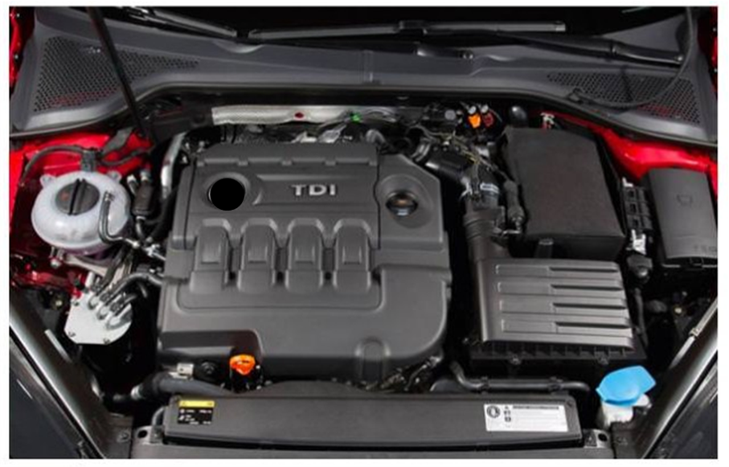
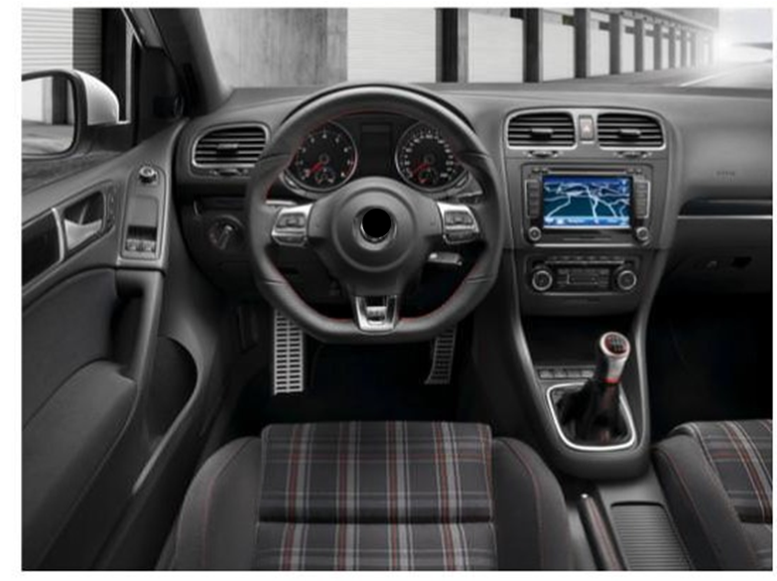

<style>
.reveal h1, .reveal h2, .reveal h3 {
  word-wrap: normal;
  -moz-hyphens: none;
}

.small-code pre code {
  font-size: 1.4em;
}
.footer {
    color: black; background: #E8E8E8;
    position: fixed; top: 90%;
    text-align:center; width:100%;
}
.midcenter {
    position: fixed;
    top: 50%;
    left: 50%;
}
.title {
  font-size: 0.3em;
  font-style: italic;
  color: white;
  text-align: center;
}
.centeremp {
  font-size: 0.3em;
  font-style: italic;
  color: red;
  text-align: center;
}
</style>

========================================================
author: 
date: 
font-family: 'Helvetica'
css: custom.css
width: 1540
height: 900

<br><br>
<div class="title" style="font-size: .8em;">A very brief..</div>

<div class="title" style="font-size: 2.5em": ">Intro to R</div>

<br><br><br>
<hr />
<p style="text-align: center;"><a href="https://github.com/mladencucak/">Mladen Čučak</a></p>
<p style="text-align: center;"><span style="color: #808080;"><em>mladencucak@gmail.com</em></span></p>


Topics
========================================================
- About R/RStudio
- Basics of programming with R
- Data analysis with `tidyverse`
  
<br><br><br><br><br>
These materials are based on the APS's "R for Plant Pathologists", a more comprehensive 
workshop available [here](https://everhartlab.github.io/APS_IntroR_2020/index.html)
 


Why R 
========================================================
<br>
-   **Performance**: stable, light and fast

-   **Support network**: documentation, community, developers

-   **Reproducibility**: anyone anywhere can reproduce results

-   **Versatility**: unified solution to *almost* any numerical problem and 
    graphical capabilities

-   **Ethics**: accessible to anyone as it is free and open source


Be strong! 
====================================
Transition from "point and click" is tough but rewarding

<div align="center">

</div>

Baby steps
====================================
<!-- I am decent programmer now. I know what to type in search box! -->
Help:
* **Google**: just add "with R" at the end of any search
* **Stack Overflow**: programming questions
* **Cross Validated**: scientific questions  

Learning:
* "R for Data Science" → <https://r4ds.had.co.nz>
* R4DS Learning Community → <https://rfordatasci.com>

<div class="centeremp" style="font-size: 1.3em;">Stay focused! Don't get overwhelmed!</div>


Your new best friends
====================================
autosize: small
Cheatsheets → <https://rstudio.com/resources/cheatsheets/>
<center></center>


====================================
transition: linear
left: 50%
<br><br>
**R** – programming language for statistical computing, data manipulation, and graphics  
<br><br>

</http://www.r-project.org/>

***
<br><br>
**RStudio** – Integrated Development Environment (IDE) makes our life much easier
   

<https://rstudio.com/>

How is that? 
====================================
left: 50%
<br><br>
**R** – Engine  
<br>


***
<br>
**RStudio** – Dashboard  
   


R interface 
====================================
<center>
...*is not the fiendliest one*...
</center>
<div class="midcenter" style="margin-left:-300px; margin-top:-200px;">
</img>
</div>

RStudio (IDE) 
====================================
<center>

</center>


R basics: In R, we have...
====================================
left: 35%
class: small-code

**Objects**, where the data is stored.

```r
x <- 1
y <- 2
x + y
```

```
[1] 3
```
the same result if: 

```r
1+3
```

```
[1] 4
```
***

R basics: In R, we have...
====================================
left: 35%
class: small-code

**Objects**, where the data is stored.

```r
x <- 1
y <- 2
x + y
```

```
[1] 3
```
the same result if: 

```r
1+3
```

```
[1] 4
```

***
**Functions** are applied on these objects to analyze the data. 

```r
addition <- 
  function(argument_one, argument_two){
  argument_one + argument_two
}
addition(
  argument_one = x,
  argument_two = y)
```

```
[1] 3
```

R basics: In R, we have...
====================================
left: 35%
class: small-code

**Objects**, where the data is stored.

```r
x <- 1
y <- 2
x + y
```

```
[1] 3
```
the same result if: 

```r
1+3
```

```
[1] 4
```

***
**Functions** are applied on these objects to analyze the data. 

```r
# I am a comment!!! Just here to help jog the memory later on...
addition <- 
  function(argument_one, argument_two){
  argument_one + argument_two
}
addition(
  argument_one = x,
  argument_two = y)
```

```
[1] 3
```

```r
# Notice the difference
addition(x, y)
```

```
[1] 3
```


Objects: Vectors
====================================
left: 50%
class: small-code

*Vectors* store data of the same type  
(a column of an excel table)
<center>

</center>
Types of data:

```r
num <- c(50, 60, 65) 

char <- c("mouse", "rat", "dog") 

fct <- factor("low", "med", "high")

dates <- as.Date(c("02/27/92", "02/27/92", "01/14/92"), "%m/%d/%y")

logical <-  c(FALSE, FALSE, TRUE) # only TRUE or FALSE
```

***
Subsetting and Indexing

```r
num[1] # 1st element
```

```
[1] 50
```

```r
num[num >= 60] # More than or equal
```

```
[1] 60 65
```

```r
char == "dog" # see logical on the left
```

```
[1] FALSE FALSE  TRUE
```

```r
char[logical]
```

```
[1] "dog"
```

```r
char[char == "dog"]
```

```
[1] "dog"
```


Objects: Dataframes
====================================
left: 40%
class: small-code

*Dataframe* is a set of vectors of same length(an entire excel table) 
<center>

</center>
Creating data frames

```r
df <- data.frame(
  col_one = num,
  col_two = char
)
print(df)
```

```
  col_one col_two
1      50   mouse
2      60     rat
3      65     dog
```

```r
head(df,1)
```

```
  col_one col_two
1      50   mouse
```

***
Same logic for indexing, just in 2 dimensions

```r
df[1, 1] # [rows, columns]
```

```
[1] 50
```

```r
df[, 1] # 1st column in the data frame
```

```
[1] 50 60 65
```

```r
df[, -2] # Exclude 2nd column
```

```
[1] 50 60 65
```

```r
df[2:3, "col_two"] 
```

```
[1] "rat" "dog"
```

```r
df$col_two
```

```
[1] "mouse" "rat"   "dog"  
```


R packages 
====================================
Pre-made set of functions for common (and not so common) tasks
<center>
</img>
</center>

Data analysis with tidyverse 
====================================
Another level: *A package of packages*  
Think something like Microsoft Office suite
<center>
</img>
</center>


Move onto some coding
====================================


- Move the cursor onto a line with R code and pres (Win)*Ctrl* + *Enter* or (MAC)*Cmd* + *Return*.  
<br>
<div align="justify">
*Challenge: Do it with one hand you are not using to hold the mouse!*
<div>

Tip for later:
- To run an entire script (Win)*Ctrl* + *Shift* + *Enter* or (MAC)*Cmd* + *Shift* +
*Return*
- Many other keyboard shortcuts in RStudio (Win)*Alt*+*Shif*+*K* or (MAC)*Option*+*Shif*+*K*


