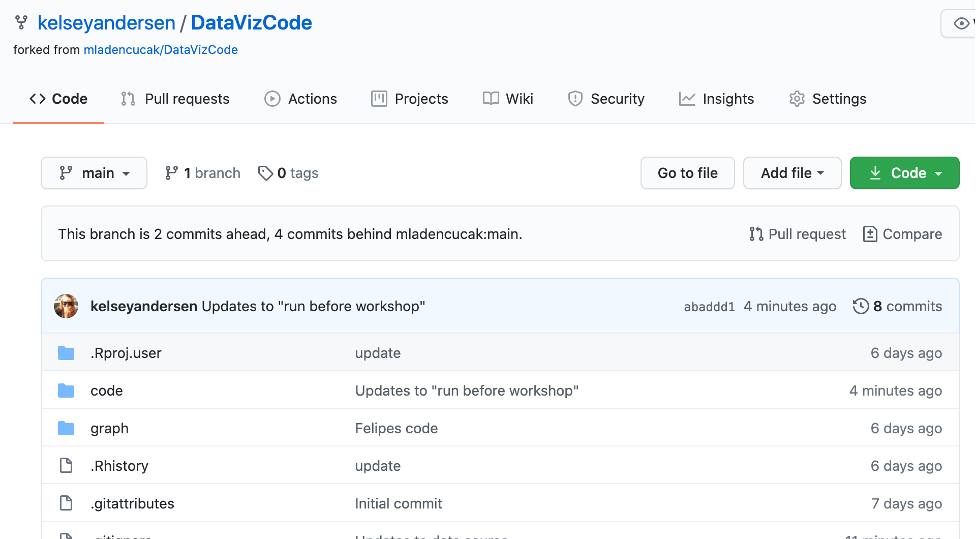

\

To ensure that you can fully participate during the workshop, please make sure you have the most recent versions of R and R Studio installed on your computer. Even if you have installed R in the past, it will be important for you to make sure you have the latest version. We have prepared this workshop with R version 4.0.3. 

#### To R download R:  
1. Go to https://cran.r-project.org/  
2. Click "Download R for Mac/Windows"  
3. Download the appropriate file:  
   - Windows users click Base, and download the installer for the latest R version  
   - Mac users select the file R-4.0.3 that aligns with your OS version  
4. Follow the instructions of the installer   

#### To download RStudio:  
1. Go to RStudio for desktop https://www.rstudio.com/products/rstudio/download/#download  
2. Select the install file for your OS  
3. Follow the instructions of the installer  

Also, it would be useful to download the following R packages prior to the workshop:  

*	here
*	tidyverse
* igraph
* ggsn
* ggsci
* sf
* ggpubr
* ggthemes


For new R useRs: open R studio and type the following code into the console, OR you can go over the "Packages" tab in the bottom right hand corner of RStudio, click "install", and type in the names of the packages that you would like to install. Once you have installed a package on your computer, there is no need to install again. Instead, each time you need to use the package you use the `library()` code (as shown below).

```r
install.packages("here")
install.packages("tidyverse")
install.packages("igraph")
install.packages("ggsn")
install.packages("ggsci")
install.packages("sf")
install.packages("ggthemes")
install.packages("ggpubr")

library(tidyverse)
library(igraph)
library(ggsn)
library(ggpubr)
library(ggsci)
library(sf)
library(ggthemes)
```

### Workshop code and data for download

All workshop material is avaiable on this website (https://kelseyandersen.github.io/DataVizR/). If you would like to download the r code (organized so you can simply run the code on your computer) prior to the workshop, that code can be found here: https://github.com/kelseyandersen/DataVizCode. 

When you click on that link, you should be directed to this repository: 



Simply click on the green "code" button in the top right corner of the page and select "download zip". Once you have downloaded the folder, there will be a file called "DataVizCode.Rproj". Click to open that file and you will open an RStudio window with code in the "files" tab that you can use to follow along during the workshop. 

Alternatively, you can follow along by copying and pasting the information on the website during the presentations. 


\
\
\

*** 